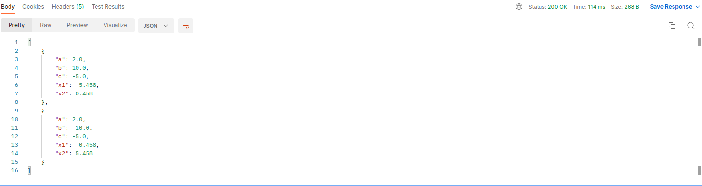

# QuadraticEquation
Приложение решает квадратное уровнение.

# Описание задачи
Реализовать веб приложение для вычисления корней квадратного уравнения вида ax^2 + bx + c = 0.

Описание процесса работы с программой.

Пользователь отправляет POST запрос на endpoint в формате JSON с полями: a, b, c - коэффициенты кв.уравнения.

Программа должна сохранить значения коэффициентов и рассчитанных корней уравнения в базу данных. 
Пользователю нужно вернуть значение корней уравнения в формате JSON с полями: x1, x2. 
Если найти корни уравнения нельзя, то необходимо вернуть пользователю ошибку.

# Требования к реализации

При разработке приложения необходимо использовать Spring, Maven, Java >8. Для работы с БД можно использовать любую ORM. 
Для сборки проекта нужно использовать Maven. Результаты нужно выложить на GitHub. 
Моменты, которые в задании явно не оговорены, можно реализовывать в соответствии с общепринятыми практиками. 

# Запуск

- Склонировать репозиторий и открыть проект
- Обновить все Maven dependencies
- Собрать проект с помощью Maven и запустить 
- Перед запуском можно запустить Unit тесты

# Тестирование API

- После запуска можно войти на http://localhost:8000/swagger-ui/ для просмотра доступных endpoint
   
- Для вычисления результата необходимо отправить POST запрос на адрес
  localhost:8000/api/calculate
   
- Для отображения всех успешных запросов и ответов необходимо отправить GET запрос на адрес
  localhost:8000/api/all
   
  

  